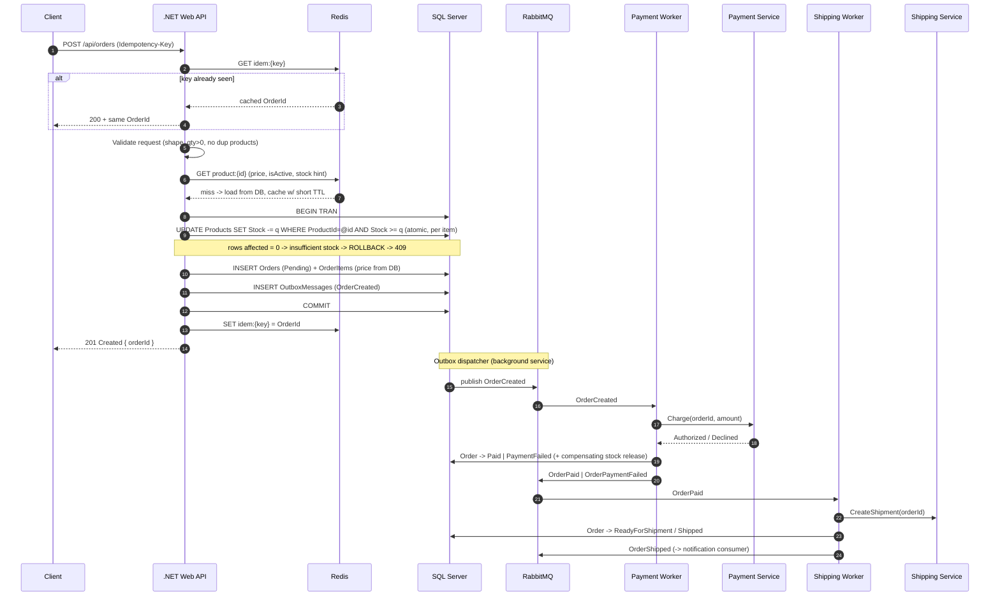

# Part 1 — System Design

## 1.1 Order Processing Flow

### Components
| Component | Responsibility |
|---|---|
| .NET Web API | HTTP entry point, validation, order creation (the only synchronous write path) |
| SQL Server | System of record. Orders, OrderItems, Products stock, idempotency keys |
| Redis | Hot-path cache (product/price/active flag), fast stock pre-check, distributed lock, idempotency cache |
| RabbitMQ | Durable hand-off between bounded steps (payment, shipment, notification) |
| Payment Service | External PSP call, owned by a consumer worker |
| Shipping Service | External carrier call, owned by a consumer worker |

### End-to-end flow



### Major steps (text form)
1. **Receive** `POST /api/orders` with an `Idempotency-Key` header.
2. **Replay check** — Redis/SQL idempotency store. Same key → return the original `OrderId`, do no work.
3. **Validate** the request shape (customer present, ≥1 item, `Quantity > 0`, no duplicate `ProductId`).
4. **Resolve products** — exists + `IsActive` + current price. Read-through Redis cache, DB as source of truth.
5. **Reserve inventory + create order in one SQL transaction**
   - conditional atomic decrement per product (see 1.4),
   - insert `Orders` with status `Pending`,
   - insert `OrderItems` with prices read from the DB (never from the client),
   - insert an **outbox** row for `OrderCreated`.
6. **Commit** → respond `201 Created { orderId }`. Everything after this is asynchronous.
7. **Outbox dispatcher** publishes `OrderCreated` to RabbitMQ (at-least-once, survives crashes).
8. **Payment worker** consumes `OrderCreated`, calls the Payment Service, writes `Paid`/`PaymentFailed`, publishes the next event. On failure it publishes a compensating `ReleaseInventory`.
9. **Shipping worker** consumes `OrderPaid`, calls the Shipping Service, moves the order to `ReadyForShipment` → `Shipped`.
10. **Status tracking** — `GET /api/orders/{id}` reads the projected status; the write path only ever advances status through a known state machine.

### Order state machine
`Pending → Paid → ReadyForShipment → Shipped → Completed`
with `Pending → PaymentFailed → Cancelled` (stock released) and `→ Cancelled` from any pre-shipment state.

---

## 1.2 Synchronous vs Asynchronous

| Operation | Mode | Why |
|---|---|---|
| Request validation | **Sync** | Cheap, in-process; the caller must be told immediately that the payload is wrong. No reason to queue garbage. |
| Product exists / active / price lookup | **Sync** | Needed to compute the total before the order can exist. Cached in Redis so it stays sub-millisecond. |
| Inventory reservation | **Sync** | This is the decision the user is waiting for — "did I get the last unit?". Deferring it means telling the customer "ordered" and later "sorry, sold out". Also it must share the same DB transaction as the order insert for consistency. |
| Order + OrderItems insert | **Sync** | Must be atomic with the reservation, and the response contract is the `OrderId`. |
| Outbox insert | **Sync** | Same transaction — this is what makes the async hand-off reliable. |
| Publish to RabbitMQ | **Async** (background dispatcher) | Broker availability must not fail a committed order. |
| Payment authorization | **Async** | Third-party latency (hundreds of ms to seconds) and third-party downtime would otherwise be inherited by every HTTP request. Needs retries + backoff, which a user-facing request cannot wait for. |
| Shipment creation | **Async** | Carrier API is slow, rate-limited, and not needed for the customer to see "order placed". |
| Email / push notification | **Async** | Zero business value on the hot path. |
| Analytics / audit projection | **Async** | Best-effort, must never block a sale. |

Reasoning against the four criteria:

- **User response time** — the synchronous path is one Redis read plus one short SQL transaction, so p99 stays in tens of milliseconds. Every external HTTP dependency is pushed off the request.
- **Reliability** — an order is durable the moment the transaction commits. Payment and shipping get at-least-once delivery with retries and a dead-letter queue instead of a single best-effort attempt tied to a live socket.
- **Service dependency** — the API depends only on SQL Server (and optionally Redis, which degrades to a DB read). PSP or carrier downtime degrades fulfilment speed, not the ability to sell.
- **Scalability** — the API becomes stateless and CPU-light, so it scales horizontally behind a load balancer; payment and shipping workers scale independently on their own queue depth, which is where the real latency lives.

---

## 1.3 RabbitMQ

### Where it sits
Between the **order write path** and every **downstream side effect**. The API never publishes directly from inside the request; it writes an `OutboxMessages` row in the same transaction and a background dispatcher publishes it. That removes the dual-write problem (order committed but message lost, or message published then transaction rolled back).

Topology: a topic exchange `orders` with durable queues bound per consumer concern.

| Queue | Routing key | Consumer |
|---|---|---|
| `orders.payment` | `order.created` | Payment worker |
| `orders.shipping` | `order.paid` | Shipping worker |
| `orders.notification` | `order.*` | Notification worker |
| `orders.inventory.release` | `order.payment_failed` | Compensation worker |
| `orders.dlq` | — | Dead-letter, alerted on |

Each queue is durable, messages are persistent, consumers use manual `ack` with a bounded `prefetch`, and failures go to a retry queue with TTL-based backoff before landing in the DLQ.

### Example messages

**1. `OrderCreated`**
```json
{
  "messageId": "order-90125-created",
  "eventType": "order.created",
  "occurredAt": "2026-10-07T08:12:33Z",
  "orderId": 90125,
  "customerId": 101,
  "totalAmount": 1000.00,
  "items": [ { "productId": 1001, "quantity": 2, "unitPrice": 500.00 } ]
}
```
Async is right here because the consumer's job is to call an external PSP. That call can take seconds, can time out, and can need three retries. Holding the customer's HTTP connection open for it would collapse throughput and turn a PSP incident into a full checkout outage. With a queue, a PSP outage only grows queue depth; orders keep being accepted and drain once the PSP recovers.

**2. `OrderPaid`**
```json
{
  "messageId": "order-90125-paid",
  "eventType": "order.paid",
  "occurredAt": "2026-10-07T08:12:41Z",
  "orderId": 90125,
  "paymentTransactionId": "ch_3Qa…",
  "paidAmount": 1000.00
}
```
Async is right because shipment creation, invoice generation, and the confirmation email are three independent consumers of the same fact. A queue fans the event out without the payment worker knowing who listens, so adding a loyalty-points consumer later needs no change to the payment code. It also decouples failure: if the carrier API is down, shipping retries while the email still goes out.

*(Additional useful events: `OrderPaymentFailed` → release inventory + notify, `OrderShipped` → tracking email, `InventoryReleased` → audit.)*

---

## 1.4 Concurrency and Overselling

Two customers buy the last unit of product 1001 at the same instant.

### The race condition
The naive implementation reads then writes:

```sql
SELECT StockQuantity FROM Products WHERE ProductId = 1001;  -- both read 1
-- both see 1 >= 1, both decide "OK"
UPDATE Products SET StockQuantity = StockQuantity - 1 WHERE ProductId = 1001;  -- ends at -1
```

Under the default `READ COMMITTED`, the shared read lock is released before the write, so both transactions pass the check. The check and the mutation are not one unit — that gap is the bug. No amount of application-level `if (stock >= qty)` closes it.

### Fix: make the check and the decrement a single atomic statement

```sql
UPDATE Products
   SET StockQuantity = StockQuantity - @Quantity
 WHERE ProductId = @ProductId
   AND IsActive = 1
   AND StockQuantity >= @Quantity;   -- the guard lives inside the write

IF @@ROWCOUNT = 0
    THROW 50001, 'Insufficient stock', 1;
```

SQL Server takes an exclusive key lock on that row for the duration of the statement, so the two `UPDATE`s serialise. The first sets stock to 0 and reports `@@ROWCOUNT = 1`. The second re-evaluates `StockQuantity >= 1` against the committed value `0`, matches nothing, and reports `@@ROWCOUNT = 0` → that transaction rolls back and the customer gets `409 Conflict`. Stock can never go negative, and no retry loop is needed for the common case.

In EF Core this is `ExecuteUpdateAsync` with the guard in the `Where` clause — one round-trip, no entity materialisation, no read-modify-write.

### Transaction and locking
- One explicit transaction wraps: reserve stock → insert `Orders` → insert `OrderItems` → insert outbox. Either the order exists with its stock deducted, or neither happened.
- `READ COMMITTED` is sufficient *because* the guard is inside the `UPDATE`. Escalating to `SERIALIZABLE` would also be correct but costs range locks and deadlocks at thousands of concurrent users.
- **Lock ordering**: when an order touches several products, reserve them sorted by `ProductId` ascending. Two orders containing products 1001 and 1002 then acquire locks in the same sequence and cannot deadlock on each other.
- Keep the transaction short — no external calls, no PSP, no RabbitMQ publish inside it. Lock hold time is the throughput ceiling.
- `SET XACT_ABORT ON` + `TRY/CATCH` so any error unwinds the whole unit.

### Alternative/complementary mechanisms
- **Optimistic concurrency** — a `rowversion` column on `Products`, update with `WHERE RowVersion = @original`, retry on conflict. Correct, but under heavy contention on one hot SKU it burns retries; the conditional `UPDATE` wins there. Useful for the `Orders` status transitions, where contention is low.
- **Redis as a pre-gate** — `DECRBY stock:{productId}` returns the new value atomically; if it goes negative, `INCRBY` back and reject before ever touching SQL Server. This sheds load on flash-sale SKUs. It is an optimisation, not the authority — SQL Server remains the source of truth, because Redis is not durable enough to be the only arbiter of money.
- **Distributed lock** (`SET NX PX` / RedLock) only where a conditional update is not expressible. Avoid as the primary strategy: it adds a failure mode (lock lost mid-operation) that the DB guard does not have.
- **Reservation rows** instead of a counter (`InventoryReservations` with a TTL and a filtered unique index) when inventory must be held during a long multi-step checkout. More moving parts; only pay for it if the business needs the hold.

### Data consistency
Within the order boundary, consistency is strong (one ACID transaction). Across boundaries (payment, shipping) it is eventual, held together by the outbox, at-least-once delivery, idempotent consumers, and explicit compensation — payment declined publishes `ReleaseInventory`, which increments stock back by exactly the reserved quantity, keyed on the order so a replay cannot double-release. A nightly reconciliation job compares `SUM(OrderItems.Quantity)` for active orders against stock movements and alerts on drift.

---

## 1.5 Duplicate Message Processing

RabbitMQ guarantees at-least-once, not exactly-once. Duplicates are normal: a consumer crashes after doing the work but before `ack`, an `ack` is lost on a dropped connection, a message is redelivered after a channel closes, or an operator replays the DLQ. Exactly-once delivery is not achievable across a network — so the consumer must be **idempotent**: processing the same message twice must leave the same state as processing it once.

### Mechanism: a processed-message ledger enforced by the database

Every message carries a stable `MessageId` (set by the producer, derived from the business fact — e.g. `order-90125-created` — not a fresh GUID per publish attempt).

```sql
CREATE TABLE ProcessedMessages (
    MessageId    VARCHAR(100)  NOT NULL,
    Consumer     VARCHAR(100)  NOT NULL,
    ProcessedAt  DATETIME2     NOT NULL CONSTRAINT DF_PM_At DEFAULT SYSUTCDATETIME(),
    CONSTRAINT PK_ProcessedMessages PRIMARY KEY (MessageId, Consumer)
);
```

The consumer does the business work and the ledger insert **in the same transaction**:

```
BEGIN TRAN
  INSERT INTO ProcessedMessages (MessageId, Consumer) VALUES (@messageId, 'payment-worker')
      -- PK violation => already handled => ROLLBACK, ack, drop
  <business work: charge, update order status, insert outbox row>
COMMIT
then ack
```

The primary key is what makes it safe. It is `(MessageId, Consumer)`, not `MessageId` alone, because one event fans out to several consumers (payment, notification, …) and each must record its own processing independently: the uniqueness check is enforced by the database under concurrency, not by an `if (alreadyProcessed)` read that has the same read-then-write race as the oversell bug. Two concurrent redeliveries of the same message cannot both insert. The message is acked either way, so a duplicate is cheap and silent.

Because work and ledger commit together, the only two outcomes are *both happened* or *neither happened* — there is no window where the order is marked paid but the ledger says unprocessed.

### Supporting measures
- **Natural idempotency where possible** — prefer state transitions guarded by the current state over blind mutation: `UPDATE Orders SET OrderStatus='Paid' WHERE OrderId=@id AND OrderStatus='Pending'`. A second delivery affects 0 rows and is harmlessly a no-op. This also prevents a late duplicate from dragging a shipped order back to `Paid`.
- **Idempotent external calls** — pass the `MessageId` (or `OrderId`) as the PSP's idempotency key so a retry after a timeout returns the original charge instead of double-charging. This matters most in the window where we called the PSP but crashed before committing.
- **API-level idempotency** — the same pattern on `POST /api/orders` via an `Idempotency-Key` header stored with the resulting `OrderId`, so a client retry on a network timeout returns the original order instead of creating a second one.
- **Retries and poison messages** — `ack` on success, `nack` without requeue into a retry queue with TTL backoff, DLQ after N attempts, with alerting. Never requeue in a tight loop; that is how one bad message saturates a worker pool.
- **Ordering** — do not assume it. Each consumer tolerates out-of-order arrival by guarding on current state, and `occurredAt` plus the state machine reject stale transitions.
- **Retention** — purge `ProcessedMessages` rows older than the maximum possible redelivery window (e.g. 7 days) with a scheduled job, so the ledger does not grow without bound.
